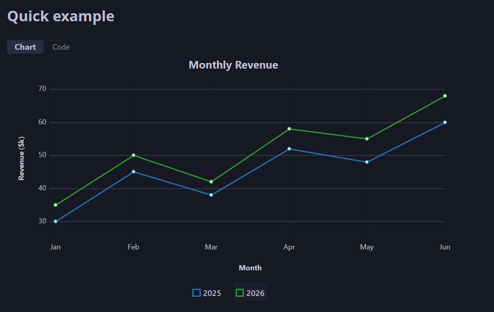

# mdbook-uplot

An [mdbook](https://rust-lang.github.io/mdBook/) preprocessor for embedding interactive [uPlot](https://github.com/leeoniya/uPlot) charts in your book.

Write chart data as fenced `` ```uplot `` code blocks in your markdown and mdbook-uplot renders them as interactive charts.

**[Live documentation and examples](https://n1ght-hunter.github.io/mdbook_uplot/)**



## Installation

### Shell (macOS/Linux)

```sh
curl --proto '=https' --tlsv1.2 -LsSf https://github.com/n1ght-hunter/mdbook_uplot/releases/latest/download/mdbook_uplot-installer.sh | sh
```

### PowerShell (Windows)

```powershell
powershell -ExecutionPolicy ByPass -c "irm https://github.com/n1ght-hunter/mdbook_uplot/releases/latest/download/mdbook_uplot-installer.ps1 | iex"
```

### cargo-binstall

```sh
cargo binstall mdbook_uplot
```

### From crates.io

```sh
cargo install mdbook_uplot
```

## Setup

Run the install command to configure your book:

```sh
mdbook-uplot install path/to/book
```

This adds `[preprocessor.uplot]` to `book.toml`, registers the JS/CSS assets, and writes asset files. Assets are kept up to date automatically on every `mdbook build`.

## Usage

Use a fenced code block with the `uplot` language tag:

````markdown
```uplot
{
  "type": "line",
  "labels": ["Jan", "Feb", "Mar", "Apr", "May"],
  "datasets": [
    { "label": "Revenue", "data": [30, 45, 38, 52, 48], "color": "#1f77b4" },
    { "label": "Costs", "data": [20, 25, 22, 30, 28], "color": "#ff7f0e" }
  ]
}
```
````

You can also reference an external JSON file instead of inlining data:

````markdown
```uplot
{ "data": "path/to/data.json" }
```
````

Paths are resolved relative to the chapter's source directory.

## Chart types

Set `"type"` to one of: `"bar"` (default), `"line"`, `"area"`, or `"scatter"`.

## Features

| Feature | Example |
|---------|---------|
| Axis labels | `"axes": { "x": "Month", "y": "Revenue" }` |
| Value formatting | `"format": { "prefix": "$", "suffix": "k", "decimals": 1 }` |
| Tooltip options | `"tooltip": false` or `{ "all": true }` |
| Legend control | `"legend": { "show": false }` or `{ "live": true }` |
| Code display | `"code": false`, or `{ "position": "side" }`, `"above"`, `"below"` |
| Editable playground | `"editable": true` — live JSON editor with syntax highlighting |
| Custom height | `"height": 250` |
| uPlot pass-through | `"opts": { "scales": { "y": { "range": [0, 100] } } }` |
| Dark theme | Automatically adapts to coal, navy, and ayu themes |

See the **[documentation book](https://n1ght-hunter.github.io/mdbook_uplot/)** for full details, live examples, and the customization reference.

## Contributing

Contributions are welcome! Please open an issue or submit a pull request.

## License

Licensed under either of
- MIT License (LICENSE-MIT or http://opensource.org/licenses/MIT)
- Apache License, Version 2.0 (LICENSE-APACHE or http://www.apache.org/licenses/LICENSE-2.0)
at your option.

Unless you explicitly state otherwise, any contribution intentionally submitted for inclusion in the work by you, as defined in the Apache-2.0 license, shall be dual licensed as above, without any additional terms or conditions.
